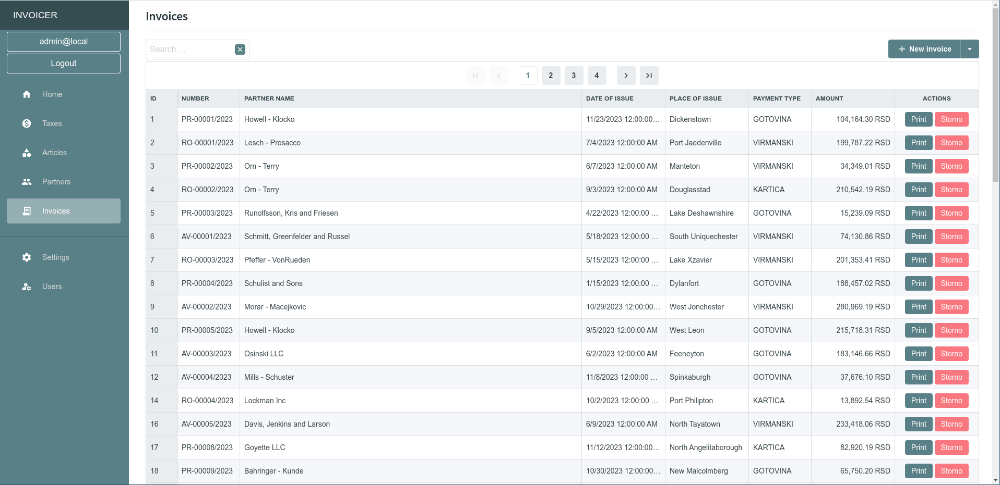

# Invoicer OSE 1.0.0

## A full-stack Blazor .NET 8 application for managing invoices for small companies

The application is a full-stack and complete application for managing partners, articles and invoices for small companies.
The application has also invoiced generation in PDF form. The invoice layout is adopted for Serbian market and because of that it is probably
less suitable for the rest of the world. However, the Quest PDF was used for PDF generation, therefore the redesigning should not be too hard.

There is also a possibility to generate IPS QR code for payment, but that is again suitable only for Serbian market, since it uses the specifications
given by NBS.

The application has the following features

- Developed with the latest .NET 8 framework
- Multi platform support (Linux, Windows and macOS)
- Multi database support (PostgreSQL and Sqlite3)
- Deploy as desktop application or SaaS
- The desktop application is completely working offline and uses SQLite3 database backend
- The server version uses PostgreSQL 16
- Multilanguage support. Currently, translation to Serbian language. The language is based on browser language settings and forced to be Serbian in the case of desktop application.
- From desktop application is possible to make backup/restore the offline database.
- Multi user support with multiple roles ("admin" and "user" currently)

By default there are two account available

- `Admin` (username: **admin@local**, password=**P@ssw0rd**)
    User with admin role (can manage application settings, and users, backup and restore database and everything that regular user can)
- `User` (username: **user@local**, password=**P@ssw0rd**)
    User with regular user role (cannot manage application settings and users)

## How to build

The application was developed on Linux and uses GNU make with targets for easier build.

The make targets are

- `build-electron           ` To build desktop version      
- `build-electron-win       ` To build desktop version for Windows (generates installer for Windows)
- `launch                   ` Launch a temp browser for testing
- `run-electron-production  ` run desktop application in production mode
- `run-sqlite               ` run application using Sqlite3 database
- `build                    ` To test build the application
- `build-electron-linux     ` To build desktop version fro Linux (generates AppImage, Snap and unpacked application)
- `clean                    ` To clean the project for rebuild      
- `run-electron             ` To run desktop application       
- `run-postgres             ` To run application using Postgres database     
- `run-sqlite-release       ` To run application in Release mode with Sqlite database

## The desktop application

The desktop version is deployed ad electron application

From the desktop application tou can backup/restore the database

1. Making a backup
2. Restore

## Docker

The project also includes all required docker related setups and scrtips. In the "docker" folder you can find the docker-compose.yml and Dockerfile files, please feel free to make changes there to match your environment.

If you want to delploy as SaaS the you should already have PostgreSQL installation, the connection parameters can be found in the config/appsettings.json config file.

## Screen shots

The login screen in SaaS version

The main dashboard

Articles

Invoices

Invoice (PDF printing)

Making invoice

---

Used 3rd party libraries

https://github.com/manuelbl/QrCodeGenerator

https://github.com/ElectronNET/Electron.NET/

https://automapper.org/

https://github.com/wieslawsoltes/Svg.Skia

https://www.radzen.com/

https://www.questpdf.com/

https://github.com/npgsql/efcore.pg

